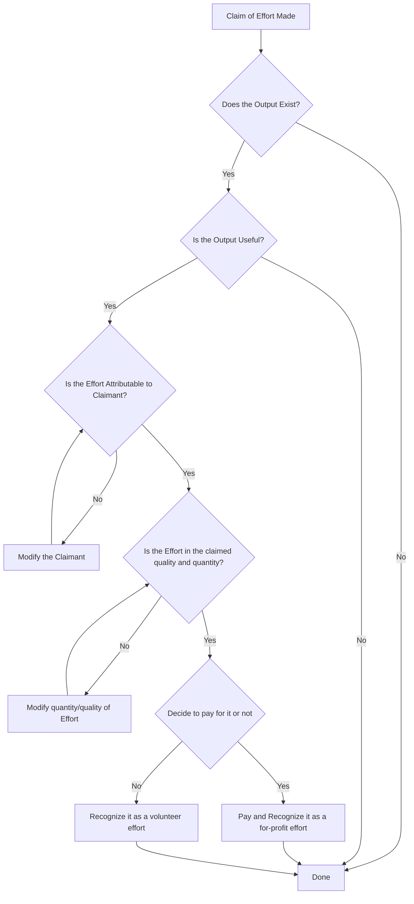
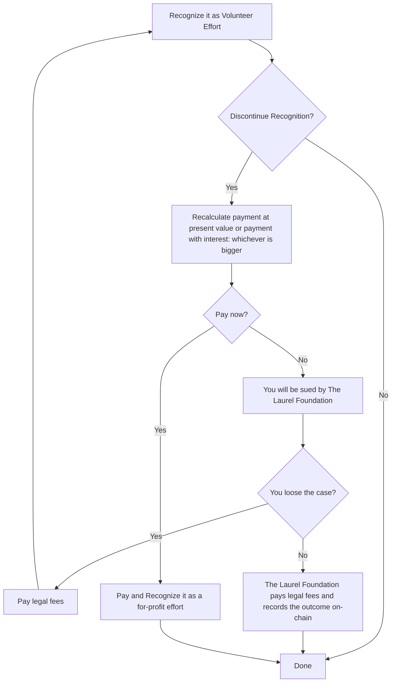

# Effort Evaluation

### Role of The Laurel Foundation

The Laurel Project is not a charity. The volunteers are not charity workers. If their volunteering effort is not recognized at any point in future as such: the volunteers deserve to be repaid for their efforts.
The Laurel Foundation is offering legal services to The Laurel Project and any other volunteer organizations that are deemed to qualify. The Foundation will defend the legal and moral rights of the volunteers.
In the event of volunteer work being unrecognized or discontinued from recognition, The Laurel Foundation will sue the offending parties for repayment or for slander.

