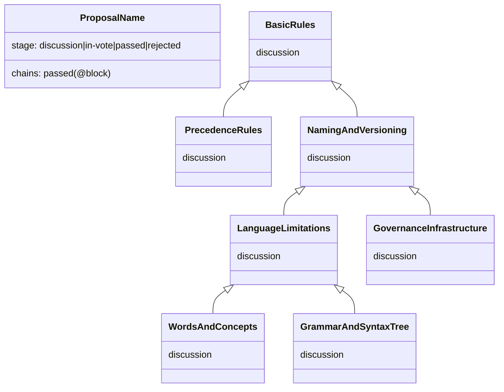
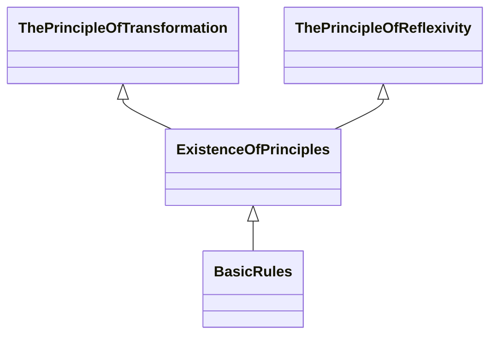
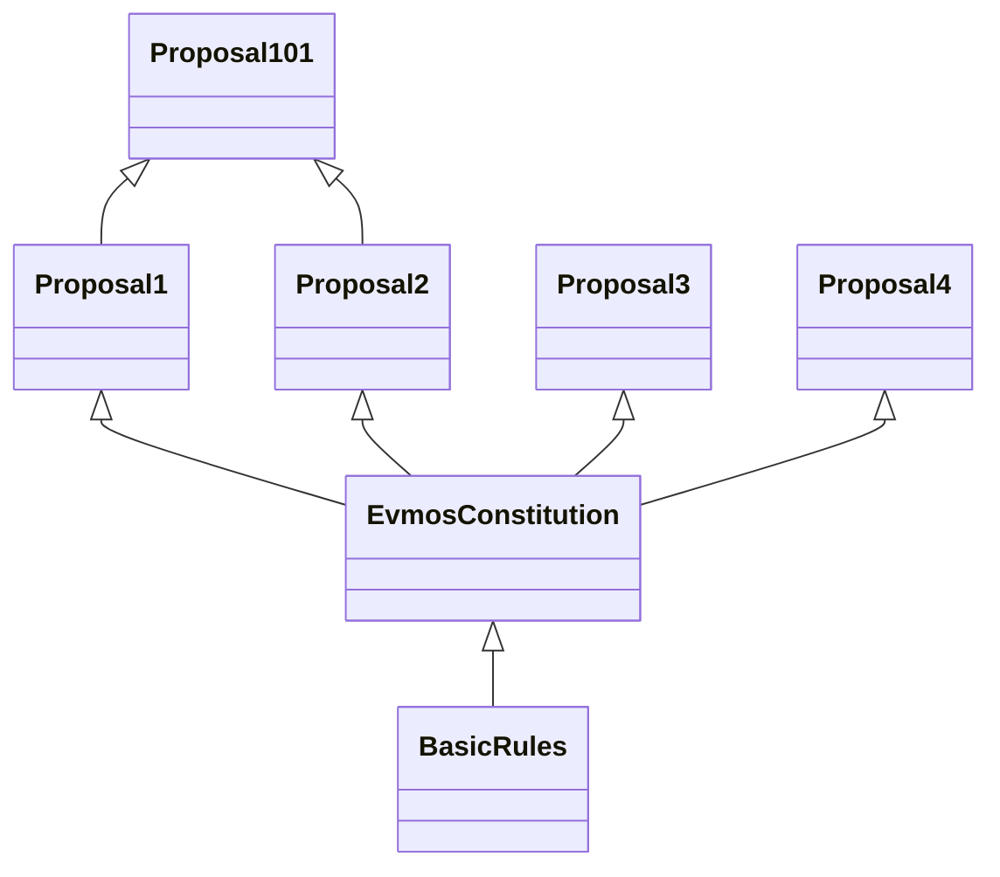

# Precedence Graph

## Basic Rules

```mermaid

classDiagram
    

 class  Grammar And Syntax Tree {
  discussion
 }
 link Grammar And Syntax Tree "https://commonwealth.im/evmos/discussion/6690-metameta-english-grammar-and-syntax-tree" 
 
 class  Words And Concepts {
  discussion
 }
 link Words And Concepts "https://commonwealth.im/evmos/discussion/6610-metameta-consensus-on-words-and-concepts" 
 
 class  Proposal Name {
  stage: discussion|in-vote|passed|rejected
  chains: passed(@block)
 }

 class  Language Limitations {
  discussion
 }
 link Language Limitations "https://commonwealth.im/evmos/discussion/6690-metameta-english-grammar-and-syntax-tree" 
 
class  Precedence Rules {
  discussion
 }
 link Precedence Rules "https://commonwealth.im/evmos/discussion/6711-metameta-precedence-rules" 
 
class Governance Infrastructure {
  discussion
}
link Governance Infrastructure "https://commonwealth.im/evmos/discussion/6708-metameta-governance-infrastructure" 

class Naming And Versioning {
  discussion
}
link Naming And Versioning "https://commonwealth.im/evmos/discussion/6710-metameta-naming-and-versioning" 

class Basic Rules {
  discussion
}
link Basic Rules "https://commonwealth.im/evmos/discussion/6712-metameta-basic-rules" 


Language Limitations <|-- Words And Concepts
Language Limitations <|-- Grammar And Syntax Tree
Naming And Versioning <|-- Language Limitations
Naming And Versioning <|-- Governance Infrastructure
Basic Rules <|-- Naming And Versioning
Basic Rules <|-- Precedence Rules


```

## Principles

```mermaid
classDiagram

The Principle Of Transformation <|-- Existence Of Principles 
The Principle Of Reflexivity <|-- Existence Of Principles 

Existence Of Principles <|-- Basic Rules

```

## Constitution

```mermaid
classDiagram

Proposal 1 <|-- Evmos Constitution
Proposal 2 <|-- Evmos Constitution
Proposal 3 <|-- Evmos Constitution
Proposal 4 <|-- Evmos Constitution

Proposal 101 <|-- Proposal 2
Proposal 101 <|-- Proposal 1

Evmos Constitution <|-- Basic Rules


```
