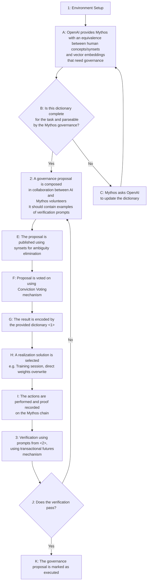

# AI Democratic Governance

## Preamble

We are volunteers for The Laurel Project and Mythos chain. This application is not seeking grants from OpenAI for our efforts: we want to donate them as a volunteer effort. Rather, we may need resources such as computing or marketing that we cannot buy by ourselves to help OpenAI on top of effort alone.

## Self Evaluation

| Metric | x/5 | Explanation |
| ---------------- | -------- | -------- |
| [Robustness](#Robustness)       | 5    | - uses blockchain tech  - uses legal means  |
| [Inclusiveness and Representativeness](#Inclusiveness-and-Representativeness) | 4    | - blockchain is already widespread  - Estonian eIDs are not available in Russia and Belarusia    |
| [Empowerment of Minority Opinions](#Empowerment-of-Minority-Opinions) | 4  | - domains of expertise will benefit from weighted voting |
| [Effective Moderation](#Effective-Moderation) | 5 | - moderation enforced by black and grey listing|
| [Scalability](#Scalability) | 5 | - by sidechains or rollups |
| [Actionability](#Actionability) | x | - as actionable as the AI model can guarantee |
| [Legibility](#Legibility) | 4 | - the process has a flow diagram |
| [+ Legal](#And-More) | 5 | - using EU and International Law |
| [+ Verification](#And-More) | 5 | - the same blockchain can be used to account for the training |
| [+ Mythos' Character](#The-Character-and-Features-of-Mythos) | 5 | - an unique combination |

*We encourage participants to establish metrics for evaluating the quality of their methods, such as participant satisfaction, shifts in polarization, scalability, or other relevant indicators, and to invent new metrics for a healthy democratic process. *

## Robustness

Mythos governance is requiring all participants to have their eID validated on-chain. The [eID-issuing authority](#eID-issuing-Authority) is guaranteeing the veracity of the information about each participant and the unicity of the identity of the same.
However: once the signatory power has been transferred from the eID to the Mythos address, even cancelation of the eID card by the Estonian authority may not stop the powers it has on-chain. That makes the system independent of Estonia.
The chain has also a claim system that can be used to claim governance/voting fraud, by a different set of smart contracts.

*Measures to prevent or address inappropriate behavior, such as trolling and fake accounts.*

## Inclusiveness and Representativeness

Mythos governance contracts for AI depend only on the user having an eID recorded. They are open to anybody to try (on the testnet) or to use (on the mainnet). Video demos are provided on YouTube and easier-to-use interfaces can be implemented for friction-free access.
We also encourage those who are familiar with the process to help others and be recognized or charge an on-chain fee for the service.

The representation can be quite flexible. By the governance plugin, the parameters of voting can be changed to achieve:
- one vote per eID
- delegated voting - such as in Liquid Democracy
- weighted voting - such as voting in domains that require expertise
- and more...
    
*Strategies for including individuals from diverse backgrounds and levels of familiarity with AI systems in the democratic process.*

## Empowerment of Minority Opinions

*Ensuring that unpopular or minority opinions are heard and providing smaller groups the opportunity to influence matters of significant concern to them.*

## Effective Moderation

*Addressing challenges in moderation, including ensuring diverse representation of viewpoints, distinguishing valuable contributions from "off-topic" comments, and preventing moderator biases from influencing the process.*

## Scalability

By using Merkle proofs, this voting can be scaled to the entire population of the planet. However, if the production of 1 block per 2-4 seconds is not enough: side-chains can be spawned out of Mythos on-demand. These chains' validator set will depend upon geographical/networking lag clustering of the validators of the mainnet.

*We emphasize scalable processes that can be conducted virtually, rather than through in-person engagement. We are aware that this approach might sacrifice some benefits associated with in-person discussions, and we recognize that certain aspects could be lost in a virtual setting.*

## Actionability

If the AI model guarantees the accuracy of the concept/vector embeddings, the governance process guarantees an actionable result.
In addition: the chain may provide/manage vector embeddings related to the target audiences that need to have their AI prompt answers governed.

*The degree of actionability of the information elicited by the deliberation process.*

## Legibility

We have below a flow diagram for the process.

*How easy it is to understand and trust the process.*

## And More

We propose that the vectors of review proposed by the description are not covering some important viewpoints:

- [Legal Authority](#Legal-Authority)
- [Ability to Verify](#Ability-to-Verify)
- [The Character and Features of Mythos]

### Legal Authority

Using eIDs as a requirement for voting makes voting carry the weight and authority of any legally binding document. That is by EU and International Law.

### Ability to Verify

We consider this the most important factor. The solution proposed will automate feedback and verification. Feedback will be done by the mechanism of transactional futures. Verification will be done by using the blockchain itself in the process of training.

### The Character and Features of Mythos

Mythos is a unique combination of moral structure and technical performance.

- moral standing:
    - is a non-profit chain built by volunteers
    - its currency is not tradeable, it is rather a measure of provable effort
    - our team helped other chains launch and provided innovation and development services as volunteers
    - we have fought the corruption of the blockchain space multiple times: as developers, as validators, and as governance proposers. One example: 
- unique technical features:
    - executes both EVM and CosmWasm via the WasmX engine
    - can serve https requests
    - manages digital identities with Oauth2
    - implemented EVM as an interpreter contract: that means it can have thousands of variants of EVM
    - can manage digital identities by a secure eID contract
    - its WasmX is very performant - it can be compiled (and executed) as a native binary (run by WasmEdge)
    - the ability to compute TensorFlow (light models) by contract
    - Mythos stack is complete: chain node, web and mobile wallet, contracts and dApp IDE
- projected features
    - extend WasmX engine to Python
    - the ability to compute large TensorFlow models via side-chains or rollups

## Mechanisms

### Transactional Futures

A consensus mechanism that extends PoS, PoA, and other compatible mechanisms, by enforcing 2 deterministic rounds for 1 transaction atomic execution. The first round establishes the clique of validators who will mine the second round (the actual execution round) (and, maybe, prepares an execution cache). This mechanism was invented by The Laurel Project for the Mythos chain. Details are in work since the full implementation is not deployed.

### Proof of Effort

The gas (computation coin) is mined by provable human effort. The actions that earn computation coin may be: validating the chain, moderating forums or language in voting options.
Also, people who appreciate your effort may award you computation coins from their earnings.

### Conviction Voting

https://blog.giveth.io/conviction-voting-a-novel-continuous-decision-making-alternative-to-governance-aa746cfb9475

## Concepts

### eID-issuing Authority

The Mythos chain favors the Estonian Police and Border Guard Board as the best [authority for providing eIDs](https://eresident.politsei.ee/). They have global coverage (unfortunately excluding Russia and Belarusia).
