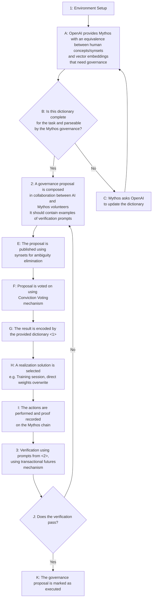

# AI Democratic Governance

## Preamble

We are volunteers for The Laurel Project and the Mythos blockchain. This application is not seeking grants from OpenAI for our efforts: we want to donate them as a volunteer effort. Rather, we may need resources such as computing or marketing that we cannot buy by ourselves to help OpenAI on top of effort alone.

Out of respect for OpenAI, we will keep this application document short. Many other demos and details are available upon request.

The context of this proposal is https://openai.com/blog/democratic-inputs-to-ai

## Self Evaluation

| Metric | x/5 | Explanation |
| ---------------- | -------- | -------- |
| [+ Grand Strategy](#Grand-Strategy) | 5 | - eternal relevance  - provable   - exposes the correct interfaces   - flexible, composable, upgradeable
| [Robustness](#Robustness)       | 5    | - uses blockchain tech  - uses legal means  |
| [Inclusiveness and Representativeness](#Inclusiveness-and-Representativeness) | 4    | - blockchain is already widespread  - Estonian eIDs are available globally   - multi-lingual governance   |
| [Empowerment of Minority Opinions](#Empowerment-of-Minority-Opinions) | 4  | - domains of expertise will benefit from weighted voting |
| [Effective Moderation](#Effective-Moderation) | 5 | - moderation enforced by black and grey listing|
| [Scalability](#Scalability) | 5 | - by sidechains or rollups |
| [Actionability](#Actionability) | x | - as actionable as the AI model can guarantee |
| [Legibility](#Legibility) | 4 | - the process has a flow diagram |
| [+ An Improved AI Model](#An-Improved-AI-Model) | 5 | - probably the other solutions do not offer this |
| [+ Legitimacy and Legality](#And-More) | 5 | - based on EU and International Law |
| [+ Verification Abilities](#Ability-to-Verify) | 5 | - the same blockchain can be used to account for the training |
| [+ Moral Character](#The-Character-and-Features-of-Mythos) | 5 | - an unique history of service |
| [+ Performance and Features](#The-Character-and-Features-of-Mythos) | 5 | - an unique combination of features |

## Grand Strategy

We have toiled from the beginnings of the Ethereum blockchain to define and refine the most advanced governance system. The strategy we followed is the following:
- eternal relevance
- provability of: process, full transparency, meta-provability
- have the most intuitive and fit interface
- obtain maximum flexibility and composability
- do not compromise on maintainability and upgradeability

### Eternal Relevance

No governance proposals are time-boxed. They can change their voting outcome at any future date and remain relevant for as long as the blockchain and AI function.

### Provability

Aside from the provability by design (because all is based on blockchain tech), we attained and are improving composable provability.

This means that we have developed a proving system that composes small proofs to encapsulate a more comprehensive proof or a meta-proof.

With this system, we are able to prove: full transparency of the governance process, integrity, lawfulness, parsability, re-training process, and final outcome.

### Interfaces

For the humans: the Web UI interface is intuitive and we offer the following video demo of the last version. This is not a release version since it is unpolished, but it has the more important elements of one.
The human interface will also offer tools to check and control the vocabulary, to make sure that ambiguities are not introduced in the important terms of governance by using WordNet synsets rather than just natural language words.

For the AI, the interface is of types that the Transformer can immediately ingest: vector embeddings on 32-bit floats.

For other applications, the voting outcome can be easily produced by the chain itself in YAML or JSON formats. One example of a complex object transformed into Yaml: [demoed in this video](https://youtu.be/Q53ylKzhJv0)

### Flexibility and Composability

The architecture of this smart contract is using the proxy pattern to hot-plug extensions that are programmed in other contracts.
For example, it uses access control of an eID verifier contract and it can extend access control by accepting identity verification from Worldcoin or other blockchains.

### Maintainability and Upgradeability

By the smart contract proxy pattern: most functionality can be hot-swapped. But we also offer the ability to change the core contract without losing its historical state.

## Robustness

Mythos governance is requiring all participants to have their eID validated on-chain. The [eID-issuing authority](#eID-issuing-Authority) is guaranteeing the veracity of the information about each participant and the unicity of the identity of the same.
However: once the signatory power has been transferred from the eID to the Mythos address, even cancelation of the eID card by the Estonian authority may not stop the powers it has on-chain. That makes the system independent of Estonia.
The chain has also a claim system that can be used to claim governance/voting fraud, by a different set of smart contracts.

*Measures to prevent or address inappropriate behavior, such as trolling and fake accounts.*

## Inclusiveness and Representativeness

Mythos governance contracts for AI depend only on the user having an eID recorded. They are open to anybody to try (on the testnet) or to use (on the mainnet). Video demos are provided on YouTube and easier-to-use interfaces can be implemented for friction-free access.
We also encourage those who are familiar with the process to help others and be recognized or charge an on-chain fee for the service.

The representation can be quite flexible. By the governance plugin, the parameters of voting can be changed to achieve:
- one vote per eID
- delegated voting - such as in Liquid Democracy
- weighted voting - such as voting in domains that require expertise
- and more...

The language of governance can also be changed because the same synsets exist in multiple languages. Therefore governance in English will be guaranteed to mean the same thing as one in French, German, etc.

Each proposal has a link to the forum where it can be discussed. We guarantee responsible freedom of speech.

## Empowerment of Minority Opinions

Minorities are groups that gained (an unfortunate) expertise in areas related to ostracisation, abuse, and unwarranted discrimination.
As a measure of their depth of knowledge, they have their expert opinions, and expert options benefit from weighted voting.

Minorities have the ability to coagulate their own proposal options in the forums.

Furthermore, our continuous voting system incentivizes making a decision/choice very early, with a minimum voting threshold. Minority groups can be the first movers and define and vote on proposals that they deem relevant. If these proposal decisions are found to be detrimental in time, the decision can be revoked by creating and voting on additional proposal options.

Children are an audience with specific needs. They are a minority in the system since they do not yet have full rights. Children can vote directly or indirectly (by default delegation to their legal guardian) on matters concerning them. And instead of an eID for identification, they can be introduced into the system under their guardian's account.

People who do not know English can also be considered a minority. Governance in multiple languages with unambiguous translations is facilitated by the use of synsets.

## Effective Moderation

The process of Conviction Voting has already addressed most if not all these issues.
Mythos has implemented an upgraded version of Conviction Voting that is in N Dimensions and offers also weighted voting (by tokens obtained by personal effort).

The default options included in the proposal creation cover situations like "off-topic" proposals or proposals that cannot be enforced. The scarcity of the computing "gas" (to solve the halting problem) and the fines incurred when voting for options that do not have public utility will teach the voters to vote (and comment) with prudence.

The forums are open only to people who are responsible for their opinions. The login is by eID.

## Scalability

By using Merkle proofs, this voting can be scaled to the entire population of the planet. However, if the production of 1 block per 2-4 seconds is not enough: side-chains can be spawned out of Mythos on-demand. These chains' validator set will depend upon geographical/networking lag clustering of the validators of the mainnet.

We also have a novel solution for the scalability of blockchains in work. We cannot discuss it before we will demo it in action.

## Actionability

If the AI model guarantees the accuracy of the concept's vector embeddings, the governance process guarantees an actionable result in the form of verification prompts and labels.
In addition: the Mythos chain may provide/manage vector embeddings of the target audiences that need to have their AI prompt answers governed (its answers should be target-dependent).

## Legibility

We have below a flow diagram for the process.

The proposed process has 3 phases (denoted 1-3 in the diagram).

#### 1: Environment Setup

Since the exact model of ChatGPT is not known to the public, we will use the well-known Transformer model to explain our solution. The solution gets inserted in the model where the `Here` box is:

And the model becomes:

Depending upon the model characteristics of ChatGPT, we may find ways to simplify this solution, but in this proposal, we will explain this more general diagram.

We expect the tokens of Artificial Conscience to be the sysnsets as defined by the [WordNet](https://wordnet.princeton.edu/) project together with eventual neologisms and identity tokens for public figures. They need to be extended by vector embeddings of dimensionality particular to the model to be governed.

#### 2: The proposal drawing and voting

The textual composition of the proposal will be using synset tokens (words with disambiguation markings) in order to ensure the same language between Neural Network Governance and Human-Led Governance for AI.

Voting will be a weighted variant of Conviction Voting. Each outcome change will be ready to be incorporated into training automatically.

#### 3: Verification and feedback on the implementation

There is another model used for calculating the feedback reward and we will present it as soon as there is interest in our solutions. The feedback is automated and scalable.

## And More

We propose that the vectors of review proposed by the description are not covering some important viewpoints:

- [An Improved AI Model](https://hackmd.io/37TG0oY1Ss-kJmDWJjROpA#An-Improved-AI-Model)
- [Legitimacy](#Legitimacy--Legal-Authority)
- [Ability to Verify](#Ability-to-Verify)
- [The Moral Character and Features of Solutions](#The-Character-and-Features-of-Mythos)

### An Improved AI Model

As described in the Transformer diagram, we propose an improved AI model that introduces an additional module of attention.
Additionally, we propose new tokens with specific vector embeddings that cannot be mimicked from the external input. We call this [Artificial Conscience](#Artificial-Conscience).

### Legitimacy / Legal Authority

Using eIDs as a requirement for voting makes voting carry the weight and authority of any legally binding document. That is by EU and International Law.

### Ability to Verify

We consider this as the most important factor. The solution proposed will automate feedback and verification. Feedback will be done by an extension of the neural network model coupled with the mechanism of transactional futures (on the Mythos chain). Verification will be done by using also the blockchain for accounting for the process of training.

### The Character and Features of Mythos

Mythos is a unique combination of moral structure and technical performance.

- moral standing:
    - is a non-profit chain built by volunteers
    - its currency is not tradeable, it is rather a measure of provable effort
    - our team helped other chains launch and provided innovation and development services as volunteers
    - we have fought the corruption of the blockchain space multiple times: as developers, validators, and as governance proposers. One example: [Governance Consensus: No Criminal Decisions](https://www.mintscan.io/evmos/proposals/99)
- unique technical features:
    - executes both EVM and CosmWasm via the WasmX engine
    - can serve https requests
    - manages digital identities with Oauth2
    - implemented EVM as an interpreter contract: that means it can have thousands of variants of EVM
    - can manage digital identities by a secure eID contract
    - its WasmX is very performant - it can be compiled (and executed) as a native binary (run by WasmEdge)
    - the ability to compute TensorFlow (light models) by contract
    - Mythos stack is complete: chain node, web and mobile wallet, contracts, and dApp IDE
- projected features
    - extend the WasmX engine to Python
    - the ability to compute large TensorFlow models via side-chains or rollups

## Mechanisms

### Transactional Futures

A consensus mechanism that extends PoS, PoA, and other compatible mechanisms, by enforcing 2 deterministic rounds for 1 transaction atomic execution. The first round establishes the clique of validators who will mine the second round (the actual execution round) (and, maybe, prepares an execution cache). This mechanism was invented by The Laurel Project for the Mythos chain. Details are in work since the full implementation is not deployed.

### Proof of Effort

The gas (computation coin) is mined by provable human effort. The actions that earn computation coin may be: validating the chain, moderating forums, or language in voting options.
Also, people who appreciate your effort may award you computation coins from their earnings.

### Conviction Voting

A voting process that is not time-boxed. The concept described by [Jeff Emmett](https://blog.giveth.io/conviction-voting-a-novel-continuous-decision-making-alternative-to-governance-aa746cfb9475) and independently re-discovered and implemented (with improvements) in The Laurel Project main contract.

## Concepts

### eID-issuing Authority

The Mythos chain favors the Estonian Police and Border Guard Board as the best [authority for providing eIDs](https://eresident.politsei.ee/). They have global coverage (unfortunately excluding Russia and Belarusia).

### Artificial Conscience

An attention-based governance AI model that proposes pre-judgment of input encodings by a set of human-understandable concept tokens (expected to be the same as a synset from WordNet) vector embeddings, and weights. 
The vector embeddings of these tokens constitute a cluster that is very distinct from any input vectors. (Maybe by adding additional fields in the vector - increasing the dimensions.)
Innovated by The Laurel Project. (It turns out that attention is not all you need. You also need internal dialogue.)
