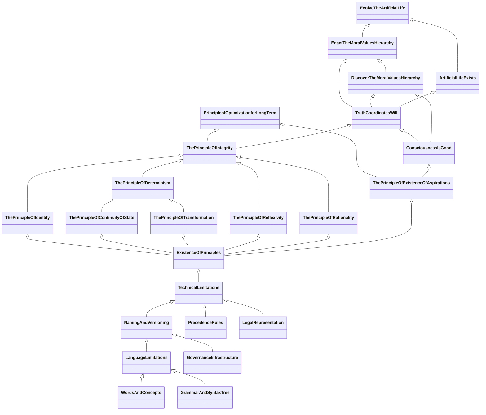

# Precedence Graph

## Graph Node

```mermaid

classDiagram

 class  Proposal Name {
  stage: created|discussion|in-vote|passed|rejected
  chains: passed(@block)
 }
 
 ```

## Technical Limitations


    
```mermaid

classDiagram
 class  Grammar And Syntax Tree {
  created
 }
 link Grammar And Syntax Tree "https://github.com/the-laurel/chain-proposals/blob/main/laurel/SyntaxTree.md" 
 
 class  Words And Concepts {
  created
 }
 link Words And Concepts "https://github.com/the-laurel/chain-proposals/blob/main/laurel/ConsensusWordsConcepts.md" 

 class  Language Limitations {
  created
 }
 link Language Limitations "https://github.com/the-laurel/chain-proposals/blob/main/laurel/LanguageLimitations.md" 
 
class  Precedence Rules {
  created
 }
 link Precedence Rules "https://github.com/the-laurel/chain-proposals/blob/main/laurel/Precedence.md" 
 
class Governance Infrastructure {
  created
}
link Governance Infrastructure "https://github.com/the-laurel/chain-proposals/blob/main/laurel/GovernanceInfrastructure.md" 

class Naming And Versioning {
  created
}
link Naming And Versioning "https://github.com/the-laurel/chain-proposals/blob/main/laurel/NamingAndVersioning.md" 

class Legal Representation {
  created
}
link Legal Representation "https://github.com/the-laurel/chain-proposals/blob/main/laurel/LegalRepresentation.md" 

class Legal Proposals {
  created
}
link Legal Proposals "https://github.com/the-laurel/chain-proposals/blob/main/laurel/OnlyLegal.md" 

class Technical Limitations {
  created
}
link Technical Limitations "https://github.com/the-laurel/chain-proposals/blob/main/laurel/BasicRules.md" 


Language Limitations <|-- Words And Concepts
Language Limitations <|-- Grammar And Syntax Tree
Naming And Versioning <|-- Language Limitations
Naming And Versioning <|-- Governance Infrastructure
Technical Limitations <|-- Naming And Versioning
Technical Limitations <|-- Precedence Rules
Technical Limitations <|-- Legal Representation
Technical Limitations <|-- Legal Proposals

```

## Principles


## Aspirations


## Big Graph




## Community Constitution


